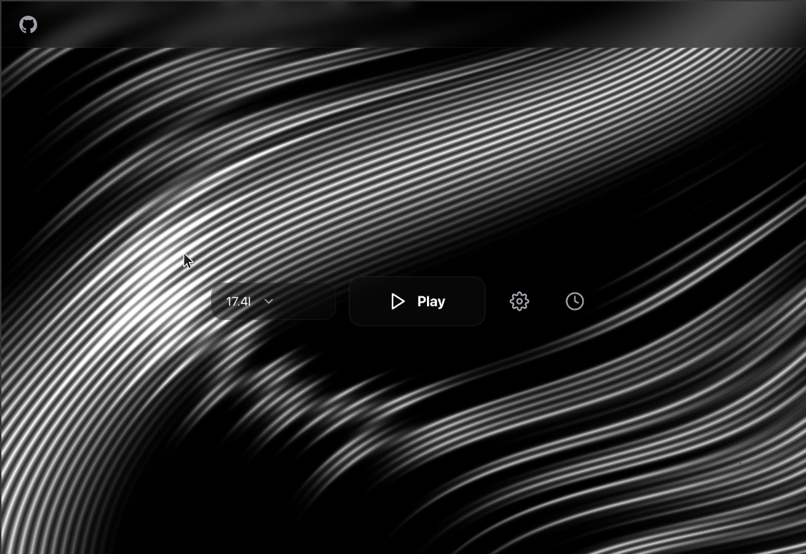

# Rigby Launcher

Rigby Launcher a native launcher for Among Us on Linux (with Windows support). Features game version management, automatic downloads, itch.io login fixer, and a glass-morphism UI with WebGL-animated background.

credits go to jogamerforgames2021, without him this launcher wouldnt be possible



## Features

- Download and manage multiple Among Us versions
- One-click itch.io authorization
- Auto-update to latest releases
- Auto-launch game on startup
- Custom Wine prefix/binary support
- Dark and white themes
- Glass-morphism UI with animated WebGL wave background

## Installation

### Linux

#### Arch Linux (PKGBUILD)
(i recommend you build it yourself because arch builds get build last and may get released later than deb or .exe)
```bash
git clone https://github.com/pileton/rigby-launcher
cd rigby-launcher
makepkg -si
```

#### Debian/Ubuntu (.deb)

```bash
sudo dpkg -i rigby-launcher_1.0.0_all.deb
sudo apt install -f
```

#### Flatpak

```bash
flatpak install rigby-launcher.flatpak
```

#### Manual (pip)

```bash
git clone https://github.com/pileton/rigby-launcher
cd rigby-launcher
pip install -r requirements.txt
python -m rigby_launcher
```

### Windows

```bash
pip install -r requirements.txt
python -m rigby_launcher
```

Or download the pre-built executable from Releases.

## Building from Source

### Linux (AppImage)

```bash
pip install pyinstaller
pyinstaller --oneidle --name rigby-launcher rigby_launcher/__main__.py
```

### Windows (PyInstaller)

```batch
pip install pyinstaller pywebview
pyinstaller --onefile --windowed --name RigbyLauncher rigby_launcher/__main__.py
```

## Packaging

See the `packaging/` directory for build scripts:
- `build-deb.sh` - Debian package
- `build-appimage.sh` - AppImage
- `build-windows.bat` - Windows executable

## License

Rigby Launcher License v1.0 — see [LICENSE](LICENSE).

This software is **free and open source** for **non-commercial use only**.
You may use, modify, and share it, but:
- **No commercial use** — you may not sell, monetize, or profit from it
- **No closed source** — all forks must include complete source code
- **No additional restrictions** — forks must use these same terms
- **Attribution required** — credit the original author
- **No warranty** — provided "as is" without liability

This license exists to keep Rigby Launcher free forever.
